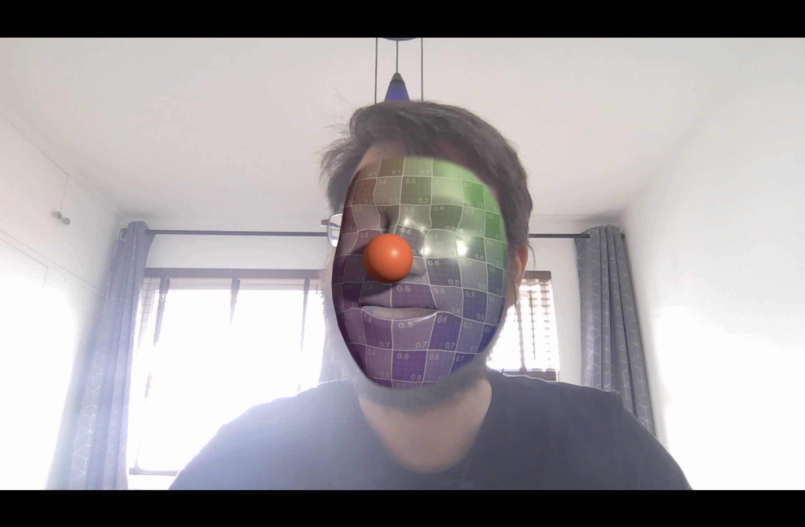

# FaceMeshFaceGeometry

A three.js `BufferGeometry` for the face mesh from [MediaPipe's Face Landmarker](https://ai.google.dev/edge/mediapipe/solutions/vision/face_landmarker). Feed it the 468 landmarks of a face and get a mesh with texture coordinates and normals that lines up with the video, plus the head pose, expression scores and irises when you need them.

**[Landing page and live examples](https://spite.github.io/FaceMeshFaceGeometry/)**



## Examples

They need a camera, and ask for permission when they open. Each has a settings panel in the top right.

| Example | What it shows |
| --- | --- |
| [Face landmarks](https://spite.github.io/FaceMeshFaceGeometry/examples/landmarks/) | Labels on 24 parts of the face, placed from the landmarks in video pixels and kept apart with a little 2D physics. |
| [Glasses and head pose](https://spite.github.io/FaceMeshFaceGeometry/examples/glasses/) | Metric mode: glasses and a clown nose follow the head in perspective, hidden behind the head where they should be, optionally over a textured mask. |
| [Expressions](https://spite.github.io/FaceMeshFaceGeometry/examples/expressions/) | Every blendshape plotted live in the panel. Open your mouth to blow bubbles. |
| [Eye gaze](https://spite.github.io/FaceMeshFaceGeometry/examples/irises/) | Arrows show where each eye is looking, from the irises and the head pose, and which way the forehead, nose, cheeks and chin face. |
| [Video-textured face](https://spite.github.io/FaceMeshFaceGeometry/examples/video/) | The face cut out of the webcam image and lit as a 3D object, wearing glasses and a clown nose. Drag to look around it. |
| [Face transfer](https://spite.github.io/FaceMeshFaceGeometry/examples/face_transfer/) | A face from a photo mapped onto yours. Pick one in the panel, or drop your own image. |
| [Face swap](https://spite.github.io/FaceMeshFaceGeometry/examples/face_off/) | With two people in view, each one wears the other's face. |
| [Instanced faces](https://spite.github.io/FaceMeshFaceGeometry/examples/instanced/) | One video-textured face drawn 500 times as an instanced mesh. |

## Install

```
npm install face-mesh-face-geometry three
```

three.js (r150 or later) is a peer dependency, so the helper uses your copy. TypeScript types are included.

```js
import { FaceMeshFaceGeometry } from "face-mesh-face-geometry";
import "face-mesh-face-geometry/gum-av"; // optional: the <gum-av> camera element
```

Without a build step, load it from a CDN with an import map. The helper imports `three` by name, so the map needs both.

```html
<script type="importmap">
  {
    "imports": {
      "three": "https://cdn.jsdelivr.net/npm/three@0.186.1/build/three.module.js",
      "face-mesh-face-geometry": "https://cdn.jsdelivr.net/npm/face-mesh-face-geometry@1/js/face.js",
      "face-mesh-face-geometry/gum-av": "https://cdn.jsdelivr.net/npm/face-mesh-face-geometry@1/third_party/gum-av.js"
    }
  }
</script>
```

The landmarks come from [MediaPipe's Face Landmarker](https://ai.google.dev/edge/mediapipe/solutions/vision/face_landmarker/web_js) (`@mediapipe/tasks-vision`), which the examples use. Faces from [@tensorflow-models/face-landmarks-detection](https://github.com/tensorflow/tfjs-models/tree/master/face-landmarks-detection) work too. The old `@tensorflow-models/facemesh` package is deprecated and no longer supported.

## Quick start

A complete page: the camera, the model, and a mesh on top of the video.

```html
<!doctype html>
<html>
  <head>
    <meta charset="utf-8" />
    <style>
      body { margin: 0; background: black; }
      gum-av, canvas { position: absolute; left: 0; top: 0; }
    </style>
    <script type="importmap">
      {
        "imports": {
          "three": "https://cdn.jsdelivr.net/npm/three@0.186.1/build/three.module.js",
          "face-mesh-face-geometry": "https://cdn.jsdelivr.net/npm/face-mesh-face-geometry@1/js/face.js",
          "face-mesh-face-geometry/gum-av": "https://cdn.jsdelivr.net/npm/face-mesh-face-geometry@1/third_party/gum-av.js"
        }
      }
    </script>
  </head>
  <body>
    <gum-av></gum-av>
    <canvas></canvas>
    <script type="module">
      import { WebGLRenderer, Scene, OrthographicCamera, Mesh, MeshNormalMaterial } from "three";
      import { FaceMeshFaceGeometry } from "face-mesh-face-geometry";
      import "face-mesh-face-geometry/gum-av";
      import { FaceLandmarker, FilesetResolver } from "https://cdn.jsdelivr.net/npm/@mediapipe/tasks-vision@1.1.0/vision_bundle.mjs";

      const av = document.querySelector("gum-av");
      const renderer = new WebGLRenderer({ canvas: document.querySelector("canvas"), alpha: true });
      const scene = new Scene();
      const camera = new OrthographicCamera(-1, 1, 1, -1, -1000, 1000);

      const faceGeometry = new FaceMeshFaceGeometry();
      scene.add(new Mesh(faceGeometry, new MeshNormalMaterial()));

      const fileset = await FilesetResolver.forVisionTasks(
        "https://cdn.jsdelivr.net/npm/@mediapipe/tasks-vision@1.1.0/wasm"
      );
      const landmarker = await FaceLandmarker.createFromOptions(fileset, {
        baseOptions: {
          modelAssetPath:
            "https://storage.googleapis.com/mediapipe-models/face_landmarker/face_landmarker/float16/1/face_landmarker.task",
          delegate: "GPU",
        },
        runningMode: "VIDEO",
        numFaces: 1,
      });

      await av.ready();

      function frame() {
        const { videoWidth: w, videoHeight: h } = av.video;
        // Size the video and the canvas alike, and frame the camera on the video's pixels.
        const width = innerWidth;
        const height = (width * h) / w;
        av.style.width = `${width}px`;
        av.style.height = `${height}px`;
        renderer.setSize(width, height);
        Object.assign(camera, { left: -w / 2, right: w / 2, top: h / 2, bottom: -h / 2 });
        camera.updateProjectionMatrix();
        faceGeometry.setSize(w, h);

        const result = landmarker.detectForVideo(av.video, performance.now());
        // <gum-av> mirrors the video for front cameras; mirror the mesh to match.
        faceGeometry.updateFromResult(result, { flipped: av.mirrored });

        renderer.render(scene, camera);
        requestAnimationFrame(frame);
      }
      frame();
    </script>
  </body>
</html>
```

The camera needs the page served over HTTPS, or from `localhost`.

## How it works

### Video space and the camera

By default the vertices are in the pixels of the input, centered on it, with y up. Call `setSize()` with the video's width and height whenever they change, and frame an orthographic camera on the same size:

```js
faceGeometry.setSize(width, height);

camera.left = -width / 2;
camera.right = width / 2;
camera.top = height / 2;
camera.bottom = -height / 2;
camera.updateProjectionMatrix();
```

The canvas must have the same aspect ratio as the video, and sit on top of it, for the mesh to line up.

### Mirrored video

Webcams usually show a mirrored image. Mirror the video element (`<gum-av>` does it for front cameras) and pass `flipped: true`, or `true` as the second argument of `update()`. Pass the landmarks as the model returns them; the helper mirrors the mesh, and keeps its triangles facing the camera.

```js
faceGeometry.updateFromResult(result, { flipped: true });
```

### Texture coordinates

The geometry comes with a fixed UV layout, the one in the image above, for textures painted on the face: masks, makeup, ambient occlusion.

Construct it with `useVideoTexture: true` and the texture coordinates follow the video instead, every frame, so a `VideoTexture` of the input maps the face onto the mesh. That lifts the face out of the frame, to light it, move it or swap it. Textures laid out on the fixed UVs won't line up any more, but you can copy the fixed UVs into a second set (`uv1`) and point a texture at it with `texture.channel = 1`, as the face transfer example does for its alpha mask.

```js
const faceGeometry = new FaceMeshFaceGeometry({ useVideoTexture: true });
const videoTexture = new VideoTexture(video);
videoTexture.colorSpace = SRGBColorSpace;
```

### A mesh independent of the video size

The size of the mesh depends on the resolution of the input. With `normalizeCoords: true` it's centered and scaled so the height of the input is 1 unit, which helps to use the face as a 3D object of its own, like the instanced example.

### Metric mode: perspective and head pose

Construct the helper with `metric: true` and the vertices are in centimeters instead, seen by a perspective camera at the origin with MediaPipe's field of view, and the head pose is available. The Face Landmarker has to return its transformation matrices:

```js
import { FaceMeshFaceGeometry, METRIC_CAMERA_FOV } from "face-mesh-face-geometry";

const landmarker = await FaceLandmarker.createFromOptions(fileset, {
  // ...
  outputFacialTransformationMatrixes: true,
});

const faceGeometry = new FaceMeshFaceGeometry({ metric: true });
const camera = new PerspectiveCamera(METRIC_CAMERA_FOV, videoWidth / videoHeight, 1, 1000);
```

The camera stays at the origin, looking down -Z, and the canvas keeps the video's aspect ratio. `normalizeCoords` doesn't apply in metric mode, and `useVideoTexture` still does.

`faceGeometry.pose` is a `Matrix4` from MediaPipe's [canonical face model](https://github.com/google-ai-edge/mediapipe/tree/master/mediapipe/modules/face_geometry/data) (centimeters, nose towards +Z) to the camera. Build things around the canonical face and they follow the head with the right perspective and scale:

```js
const head = new Group();
head.matrixAutoUpdate = false;
head.add(glasses);
scene.add(head);

// Every frame, after faceGeometry.updateFromResult():
head.matrix.copy(faceGeometry.pose);
head.matrixWorldNeedsUpdate = true;
```

The canonical face's vertices are exported as `CANONICAL`, to place things relative to landmarks: the glasses in the examples are built around the canonical eyes. With a mirrored video, the pose is mirrored too.

To hide what's behind the face or the head, draw the face mesh, and maybe an approximate head volume, with `new MeshBasicMaterial({ colorWrite: false })` and a negative `renderOrder`. It writes depth but no color, so the video shows through and things behind it disappear.

### Blendshapes and irises

Ask the Face Landmarker for blendshapes with `outputFaceBlendshapes: true`, and pass the whole result to `updateFromResult()`. Then:

- `faceGeometry.blendshapes` has every score, from 0 to 1, by name: `jawOpen`, `eyeBlinkLeft`, `mouthSmileRight` and so on. MediaPipe returns 52, the first being `_neutral`. "Left" and "Right" are the person's sides.
- `faceGeometry.rightIris` and `faceGeometry.leftIris` are `{ position, radius }`, in the same space as the vertices. The model returns the iris landmarks by default; `faceGeometry.hasIrises` says whether they were there.

The gaze example combines the irises with the head pose to estimate where each eye is looking.

### Points on the surface

`track(a, b, c)` returns the center, normal and an orthogonal basis of the triangle between three vertices, to pin things to the surface of the face:

```js
const track = faceGeometry.track(5, 45, 275);
nose.position.copy(track.position);
nose.rotation.setFromRotationMatrix(track.rotation);
```

For the vertex numbers, see MediaPipe's [canonical face model UV visualization](https://github.com/google-ai-edge/mediapipe/blob/master/mediapipe/modules/face_geometry/data/canonical_face_model_uv_visualization.png), or [this image](https://user-images.githubusercontent.com/7452527/53465316-4a282000-3a02-11e9-8e85-0006e3100da0.png).

## Camera component

`<gum-av>` is a standalone custom element, with no dependencies, that the examples use to get the camera. It's in the package as `face-mesh-face-geometry/gum-av`:

```html
<script type="module">
  import "face-mesh-face-geometry/gum-av";
</script>
<gum-av facing="user"></gum-av>
```

It opens the camera when added to the page and releases it when removed. Its switch button toggles between front and back cameras on phones, and goes through every camera on desktop, skipping the ones that can't be opened, like an idle OBS Virtual Camera or an infrared sensor. It closes one camera before opening the next, which phones need, resumes when the page comes back from the background, notices cameras being plugged in or out, and offers a retry if the camera fails or another app takes it.

- **Attributes:** `facing="user|environment"`, `width` and `height` (the ideal resolution, 1280x720 by default), `mirror="auto|true|false"` (auto mirrors front and desktop cameras), and `controls="false"` to hide its button and label.
- **`await el.ready()`** resolves when the camera has frames, and rejects if it can't be opened.
- **`el.video`** is the `<video>` element. It stays the same element across camera switches, so a `VideoTexture` made from it keeps working.
- **`el.facingMode`**, **`el.mirrored`** (settable), **`el.next()`**, **`el.start()`**, **`el.stop()`**.
- **Events:** `ready` each time a camera starts giving frames, and `error`.

## API

### `new FaceMeshFaceGeometry(options?)`

| Option | Default | |
| --- | --- | --- |
| `useVideoTexture` | `false` | Texture coordinates that follow the input video. |
| `normalizeCoords` | `false` | Center the mesh and scale it so the input's height is 1 unit. |
| `metric` | `false` | Vertices in centimeters for a perspective camera, with the head pose. |

### Methods

**`setSize(width, height)`** sets the size of the input, to frame the coordinates. Call it before updating, and whenever the video size changes.

**`updateFromResult(result, { index = 0, flipped = false })`** updates the geometry, blendshapes, irises and pose from the face at `index` of a `FaceLandmarkerResult`. Returns `false` if there's no such face.

**`update(face, flipped = false, transformationMatrix?)`** updates the vertices and normals from one face: an entry of `faceLandmarks` from MediaPipe (normalized coordinates), or a face with `keypoints` from face-landmarks-detection (pixels). Metric mode needs the face's transformation matrix, from `facialTransformationMatrixes`.

**`track(id0, id1, id2)`** returns `{ position, normal, rotation }` for the triangle between three vertices: its center, its normal, and a `Matrix4` basis.

### Properties

| Property | |
| --- | --- |
| `pose` | `Matrix4` from the canonical face to the camera, in centimeters. Metric mode only. |
| `blendshapes` | Expression scores, from 0 to 1, by name. |
| `rightIris`, `leftIris` | `{ position: Vector3, radius: number }`, in the same space as the vertices. |
| `hasIrises` | Whether the last update had iris landmarks. |
| `positions`, `uvs` | The `Float32Array`s behind the position and uv attributes. |

### Exports

| Export | |
| --- | --- |
| `FaceMeshFaceGeometry` | The geometry. |
| `METRIC_CAMERA_FOV` | Vertical field of view, in degrees, for the camera in metric mode (63). |
| `FACES` | Triangle indices of the mesh. |
| `UVS` | The fixed texture coordinates of the 468 vertices. |
| `CANONICAL` | Vertices of MediaPipe's canonical face model, in centimeters. |

The mesh data is also available on its own, from `face-mesh-face-geometry/geometry`.

## Running the examples

Clone the repo and serve it; any static server works:

```
npm start
```

That runs `npx serve .`. Then open http://localhost:3000/ for the landing page, or an example like http://localhost:3000/examples/landmarks/. The examples use the files in the repo directly, with an import map for three.js.

## License

MIT
